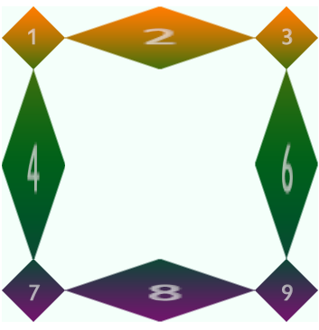
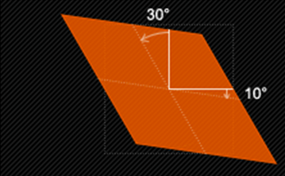
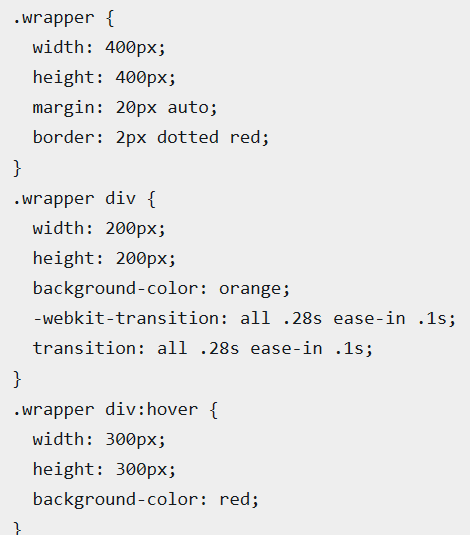
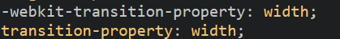
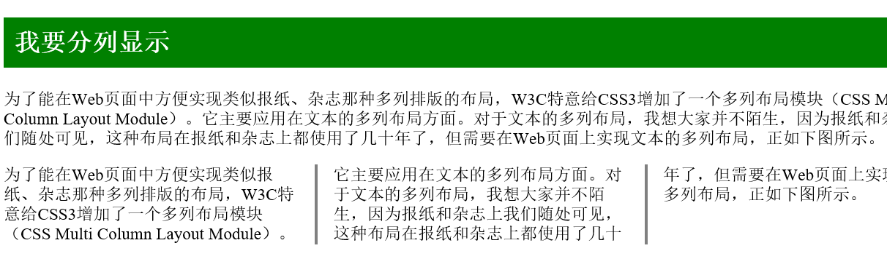
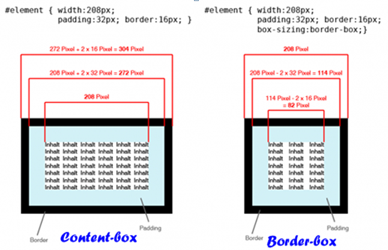
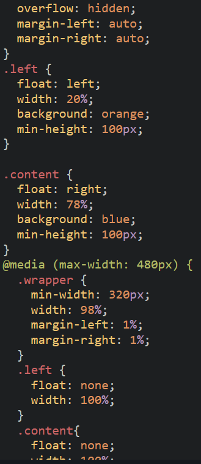

###box-shadow
	box-shadow:0 1px 4px rgba(0, 0, 0, 0.3), 0 0 40px rgba(0, 0, 0, 0.1) inset;
前两个数值时偏移量，后一个是模糊半径；  
第一个是外阴影，第二个是内嵌阴影，注意看inset这个属性
###线性渐变liner-gradient

	background:liner-gradient(to bottom,#fff,#999)
						  	渐变方向等价与180deg			颜色的起始点和终点
###径向渐变radial-gradient
[http://www.css88.com/book/css/values/image/radial-gradient().htm](http://www.css88.com/book/css/values/image/radial-gradient().htm)
###border-image:url 切割图片的像素 方式（round圆满的铺满|stretch拉伸|repeat重复）;

	border-image:url(border.png) 70 70 70 70 round;
  
  


####.text-overflow:
设置是否使用省略标记  
text-overflow:clip(剪切)|ellipsis(显示省略标记)  
####white-space:nowrap 
强制文本在一行显示  
####overflow:hidden  
溢出内容为隐藏
####word-wrap:
文本超过容器边界时是否转行  
normal(控制连续文本换行)|break-word(内容将在边界内换行
```javascript
  text-overflow:epllipsis;
  overflow:hidden;
  white-space:nowrap;
```
  

####@font-face
自定义字体
```javascript
    @font-face{
    font-family:字体名称；
    src:字体文件路径
    }
```
####text-shadow
```
text-shadow:x-Offset Y-Offset blur color;
```
blur:阴影的模糊程度，不能为负  
text-shadow: 2px 2px 20px red,-2px -2px 20px white;加逗号可以设置多个阴影
####background-origin
背景图片的起始点
border-box:从边框  
padding-box:从内边距  
content-box:从内容区域即其子元素  

####background-clip
裁剪背景位置  
属性:  
border-box   
padding-box  
content-box


####background-size
值：
auto：使用默认值
长度值：200px 50px
百分比
cover:覆盖，等比缩放填满整个容器
contain:容纳，等比缩放至贴紧容器边缘


##伪类选择器

###root根选择器
###not否定选择器

	    div:not([id=footer]){
        background:orange;
    }
###:empty
选择器表示的就是空。用来选择没有任何内容的元素，这里没有内容指的是一点内容都没有，哪怕是一个空格。
###:target
选择器称为目标选择器，用来匹配文档(页面)的url的某个标志符的目标元素。我们先来上个例子，然后再做分析。
	
	#brand:target p {
     	background: orange;
    	 color: #fff;
	}
	</style>
	</head> 
	<body>
    	<div class="menuSection" id="brand">
    	    <h2><a href="#brand">Brand</a></h2>
    	    <p>content for Brand</p>
    	</div>
	</body>
URL 带有后面跟有锚名称 #，指向文档内某个具体的元素。这个被链接的元素就是目标元素(target element)
###：first-child
###:last-child
###nth-child(n)
###nth-last-child()
###first-of-type
###last-of-type
###nth-of-type()
###nth-last-of-type()
###only-child
###only-of-type
###:enabled
###disabled
###:selected(鼠标选择)
###:checked
###read-only
###read-write
###::after ::before
##变形
###rotate旋转
	
	transform:rotate(20deg);
正值为顺时针
###skew扭曲
	
	transform:skem(20deg,5deg);


###scale缩放
	transform:scale(1.8,1.8);
前值为X轴方向，后值为y轴方向（即宽高）  
**注意**： scale()的取值默认的值为1，当值设置为0.01到0.99之间的任何值，作用使一个元素缩小；而任何大于或等于1.01的值，作用是让元素放大
###translate位移
	
	transform:translate(100px,100px);
	transform；translate(50%,50%);
###matrix矩阵
[http://www.zhangxinxu.com/wordpress/2012/06/css3-transform-matrix-%E7%9F%A9%E9%98%B5/](http://www.zhangxinxu.com/wordpress/2012/06/css3-transform-matrix-%E7%9F%A9%E9%98%B5/ "matrix")  
**Matrix()与translate()关系：translate(x,y)对应Matrix(1,0,0,1,x,y);  
Matrix()与scale()关系：scale(x,y)对应Matrix(x,0,0,y,0,0);  
Matrix()与rotate()关系：rotate(x)对应Matrix(cos(x),sin(x),-sin(x),cos(x),0,0)  
Matrix()与skew()关系：skew(x,y)对应Matrix(1,tan(x),tan(y),1,0,0)** 
###transform-origin
用来设置元素的运动基点，transfrom-origin：50% 50%表示元素运动基点在整个中心是个默认值。px代表元素运动离元素运动基点的距离
##动画

###transition-property过渡属性
	
	指定过渡的css属性
  

  
假设你的初始状态设置了样式“width”,“height”,“background”,当你在终始状态都改变了这三个属性，那么all代表的就是“width”、“height”和“background”。
###transition-duration动画时间
从一个属性过渡到另一个属性需要的时间

	transition-duration:0.2s;
###transition-delay过渡延迟时间
触发动作，过渡开始前的时间

	transition-delay:.2s;
###transition-timing-function过渡函数
**值：**  
ease:速度由快至慢  
linear:匀速  
ease-in:渐显(加速) （比ease效果更明显）   
ease-out:渐隐（减速）  
ease-in-out:渐显渐隐（先加速再减速）  

###keyframes关键帧

	@keyframes changecolor{
		0%{
			background:yellow;
		}
		40%{
			background:red;
		}
		60%{
			background:blue;
		}
	}
	div:hover{
		animation:changecolor 5s ease-in .2s;
	}	
###animation-name
**值：**  
none：无动画效果，可用覆盖任何动画  
indent:@keyframes创建的动画名
###animation-duration动画时间
###animation-timing-function动画播放方式
###animation-delay多长时间以后开始播放动画
###animation-iteration-count 动画重复次数
**值：**  
infinite无限或数字  
	animation-iteration-count:5;	
###animation-direction
**值：**  
normal:每次循环都是向前播放   
alternate:偶数次向前播放，奇数次反向（反复）	
###animation-play-state
**值：**  
paused暂停   
running播放（从暂停的地方开始播放）

	demo:当鼠标放到元素上时元素才会移动	
	div{
		animation:move;
		animation-duration:10s;
		animation-timing-function:ease-in;
		animation-delay:2s;
		animation-direction:alterate;
		animation-play-state:paused;	
	}
	div:hover{
		animation-play-state:running;	
	}
###animation-fill-mode
**值：**  
none：动画结束后回到初始帧状态  
forwards:动画结束后停止在最后一帧状态  
backwards:在animate-delay指定的时间之前应用初始帧   
both:forwards+backwards
##3D转换
[http://www.zhangxinxu.com/wordpress/2012/09/css3-3d-transform-perspective-animate-transition/](http://www.zhangxinxu.com/wordpress/2012/09/css3-3d-transform-perspective-animate-transition/)
##布局
###columns多列布局
**值：**
width+列数‘
	
	columns:150px 3;
#####column-width:
#####column-count:
#####column-gap列间距：
#####column-rule列边框
#####column-span跨所有列：all|none(不跨列)
	
	column-count: 3;
	column-gap: 2em;
	column-rule:1px solid red;

###盒模型box-sizing

在自适应布局中通常会因为padding将布局打乱，border-box可解决

	.dov1{
		width:60%;
	}
	.div2{
		width:40%;
		padding:40px;	
		box-sizing:borde-box;
	}
###伸缩布局
[http://www.ruanyifeng.com/blog/2015/07/flex-grammar.html?utm_source=tuicool
](http://www.ruanyifeng.com/blog/2015/07/flex-grammar.html?utm_source=tuicool)

display:flex;  
主轴方向flex-direction:row|row-reverse|column|column-reverse  
决定侧轴flex-wrap:nowrap|wrap|wrap-reverse  
以上简写：flex-flow:<flex-direction>值 flex-wrap值； 
 
主轴对其方式：justify-content:flex-start|flex-end|center|space-between|space-around    
侧轴对其方式:align-items:flex-start|flex-end|center|stretch|baseline  
多行侧轴对其方式：align-content:flex-start|flex-end|center|space-between|space-around 
 
排列顺序：order:数字（数值越小排列越靠前）  
若想设置两个元素一个排第一，一个排最后则需将前者设为-1；后者设为0即可
  
放大flex-grow：数字（按元素比例，默认为0）  
缩小flex-shrink:数字（按元素比例2倍3倍等，默认为1）  
伸缩基准值：flex-basis:auto(默认)|<length px>  
以上三种属性的缩写flex:none(0 0 auto)|[flex-grow(必须) flex-shrink(可选) flex-basis(可选)] （默认为0 1 auto）
flex-self覆盖align-items

##媒体类型
常用：srceen(电脑屏幕) all(全部) print(打印或打印预览模式   
###媒体类型引用
####1.media方法
（1）link中调用
	
	<link style="text/css" url="" rel="stylesheet" media="srceen" ></link>
	//默认为all
（2）样式文件中引用媒体类型
	
	@media srceen{
		选择器{样式代码}
	}
（3）在head中调用
	
	<head>
		<style type="text/css">
			@media{
				选择器{样式代码}
			}
		</style>
	</head>
####1.@import
用法同media，除media的第一个方法外
（1）
	
	@importurl(reset.css) print;
（2）ie6,ie7不兼容
	
	<head>
		<style type="text/css">
			@importurl(reset.css) all;
		</style>
	</head>
###media queries使用方法
####最大最小宽度max-width/min-width
定义适用于何种屏幕大小的设备中
	
	@media srceen and (max-width:800px){
		.ads{
			display:none;
		}	
	}
	//当屏幕等于或小于800px时，广告窗口消失
	@media srceen and (min-width:800px){
		.wrapper{
			width:900px;
		}
	}
	//当屏幕大于800px时，.wrapper容器宽度变为900px
综合
	
	@media srceen and (min-width:300px) and (max-width:800px);
####限制设备宽度
	
	<link rel="sheetstyle" media="srceen and (max-device-width:450px)" href="iphone.css">
	//iphone.css”样式适用于最大设备宽度为480px，比如说iPhone上的显示
####not
	
	@media not print and (max-width:1200px){样式}
	//样式代码将被使用在除打印设备和设备宽度小于1200px下所有设备中

####only
	@<link rel="sheetstyle" media="only srceen and(max-device-width:450px)" href="android240.css">
####多条语句
	<link rel="sheetstyle" media="srceen and(max-width:800px), handheld and(max-width:480px)" href="">
###响应式responsive设计
####条件
1.流体网格  
2.弹性图片
	
	img{max-width:100%};
	
	来看一个断点解决图片自适应的例子。
	
3.媒体查询  
根据设备的尺寸，查询出适配的样式

**注意：**
在Responsive布局中，可以毫无保留的丢弃：  
第一， 尽量少用无关紧要的div；  
第二，不要使用内联元素（inline）；  
第三，尽量少用JS或flash；  
第四，丢弃没用的绝对定位和浮动样式；  
第五，摒弃任何冗余结构和需要使用100%设置
####meta标签
<meta name="" content="">


	<meta name=”viewport” content=”width=device-width,minimun-scale=1.0” />
	//适应设备宽度，不可缩放
为适应IE老版本的脚本
	
	media-queries.js(http://code.google.com/p/css3-mediaqueries-js/)      

 	respond.js(https://github.com/scottjehl/Respond)

 	<!—[if lt IE9]>
      <scriptsrc=http://css3-mediaqueries-js.googlecode.com/svn/trunk/css3-mediaqueries.js></script>
 	​<![endif]>

###实例
1.1024px显屏

	@media srceen and(max-device－width:1024px){样式}
2.800px显屏   
3.640px显屏  
4.ipad横版
	
	@media srceen and (max-device－width:1024px) and(orientation定向:landscape横){样式}
5.ipad竖屏

	@media screen and (max-device-width: 768px) and (orientation: portrait)
6.iPhone 和 Smartphones
	
	@media screen and (min-device-width: 320px) and (min-device-width: 480px) 



##用户界面及其他重要属性
###resize用户自行拖拽宽高
**值：**  
none:不允许拖拽  
both:宽高都可  
horizontal水平：仅修改宽度  
vertical竖直：仅修改高  
inherit:继承父元素resize属性值
###outline外边框
	
	outline:red solid 2px;
	outline-offset:5px  //偏移量 正值为向外偏移，负值为向内偏移 需单独写
	outline：inherit
###content生成内容
配合:before（插入元素之前）:after（插入元素之后）使用  
**值：** 
none  
attr()插入标签属性值
	
	a:before{
		content:attr(title); 
	}
	<a href="#" title="我要插进去">  
url()插入外部资源 
string插入字符串（直接插字符串）eg:content:"插"；