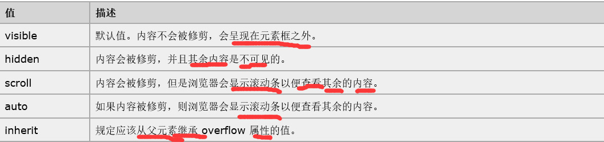

##5.9 HTML杂记
1.static和relative会占据文档流空间absolute和fixed脱离文档流。

2.BFC(Block Formatting Contexts)直译为"块级格式化上下文"。Block Formatting Contexts就是页面上的一个隔离的渲染区域，容器里面的子元素不会在
布局上影响到外面的元素，反之也是如此。如何产生BFC？
float的值不为none。    overflow的值不为visible。       position的值不为relative和static。     display的值为table-cell, table-caption, inline-block中的任何一个。 
 那BFC一般有什么用呢？比如常见的多栏布局，结合块级别元素浮动，里面的元素则是在一个相对隔离的环境里运行。  
3.overflow(溢出):  
:  
overflow:hidden   盒子里元素是浮动元素时，盒子用overflow:hidden就有清除浮动的效果，浮动元素和盒子又在一个层

上，当父元素没有指定高度，就会根据子元素撑开了父元素的高度，而不是溢出隐藏切掉多出来的部分
