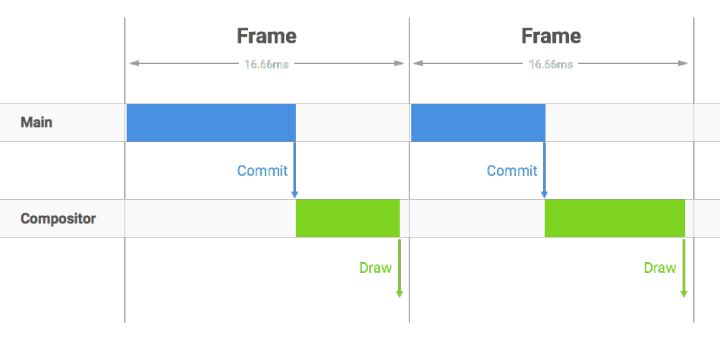
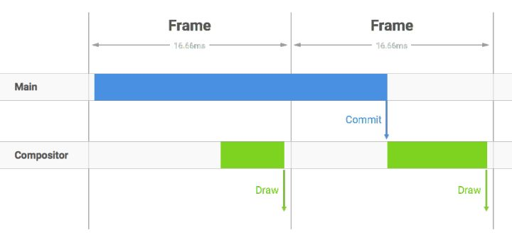
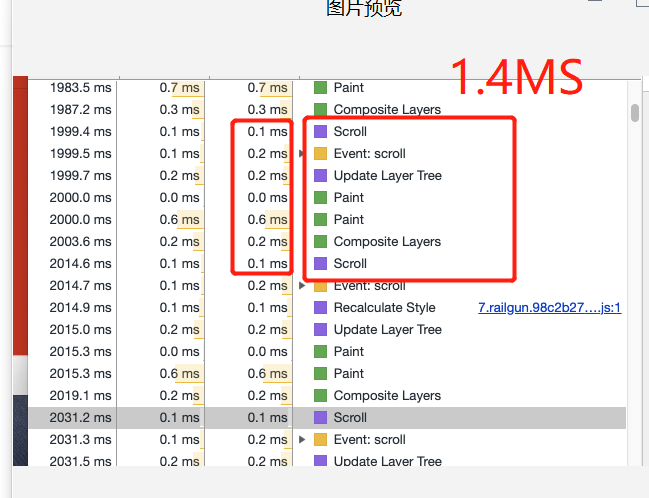
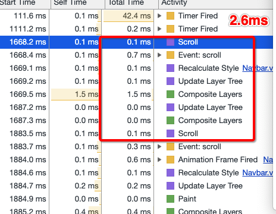
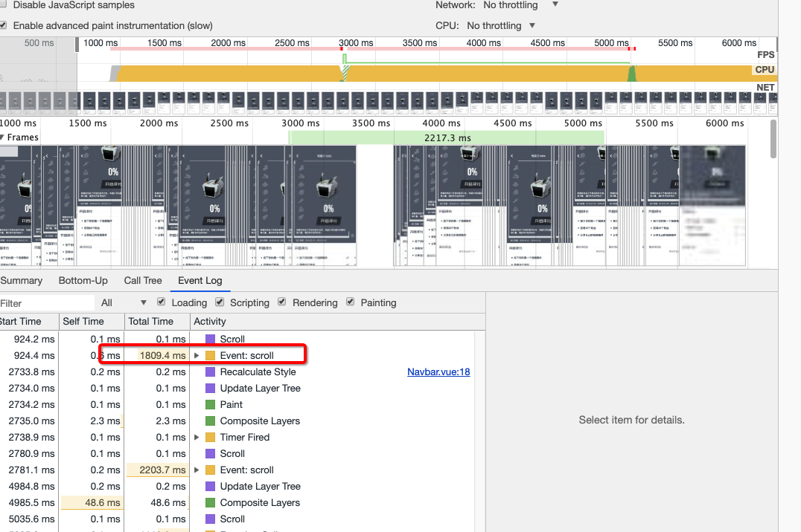

# scroll事件衍生出的浏览器背后性能的思考
问题：  
  scroll事件下绑定的对一个dom元素的color修改，会不会影响到浏览器性能，需要做节流吗？	
## 渲染帧
概念：指的是浏览器从js执行到paint的一次绘制过程，帧与帧之间快速地切换，形成动画效果。      
目前大多数浏览器屏幕的刷新频率——60次/s，浏览器的渲染更新的页面的标准帧率也为60FPS。

### 帧渲染的过程
DOM Tree： 浏览器讲HTML解析成树形的数据结构。  
CSS Rule Tree：浏览器将CSS解析成树形的数据结构。  
Render Tree：DOM树和CSS规则树合并后生产Render树。  
layout：有了Render Tree，浏览器已经能知道网页中有哪些节点、各个节点的CSS定义以及他们的从属关系，从而去计算出每个节点在屏幕中的位置。  
painting: 按照算出来的规则，通过显卡，把内容画到屏幕上。

###渲染步骤： 
浏览器内核拿到响应报文之后，渲染大概分为以下步骤

解析html生产DOM树。  
解析CSS规则。  
根据DOM Tree和CSS Tree生成Render Tree。  
根据Render树进行layout，负责各个元素节点的尺寸、位置计算。  
绘制Render树(painting)，绘制页面像素信息。  
浏览器会将各层的信息发送给GPU，GPU会将各层合成（composite），显示在屏幕上。  
## 浏览器渲染进程
blink和webkit引擎内部都是使用了两个进程来搞定JS执行、页面渲染之类的核心任务。

* Renderer进程
主要进程，每个tab一个。这个进程负责执行JS和页面渲染。包含3个线程：Compositor Thread、Tile Worker、Main thread。
* GPU进程
整个浏览器共用一个。主要是负责把Renderer进程中绘制好的tile位图作为纹理上传至GPU，并调用GPU的相关方法把纹理draw到屏幕上（一般的介绍浏览器渲染引擎的文章里都用paint这个词表述把内容光栅化和绘制到位图里，而用draw这个词表示GPU最终把纹理显示到屏幕上）。
### Main thread
执行上述渲染步骤
### Compositor Thread
这个线程既负责接收浏览器传来的垂直同步信号(从屏幕顶部到底部的绘制已经完成，指示着前一帧的结束，和新一帧的开始)， 也负责接收传来的用户交互，比如滚动。  
Compositor Thread会直接负责处理这些输入，然后转换为对layer的位移和处理，并将新的帧直接commit到GPU Thread，从而直接输出新的页面。  
当我们在滚动事件上注册了回调，Compositor Thread便会唤醒Main Thread，让后者去执行JS、完成重绘、重排等过程，产出新的纹理，然后Compositor Thread再进行相关纹理的commit至GPU Thread，完成输出。

在一个标准帧渲染时间16.7ms之内，浏览器需要完成Main线程的操作，并commit给Compositor进程

主线程里操作太多，耗时长，commit的时间被推迟，浏览器来不及将页面draw到屏幕，导致丢帧，直接的影响就是页面卡顿。
### 通过Chrome DevTools来分析绘制复杂度和时间消耗
  
#### 本案例：   

* 一次屏幕刷新的时间间隔16.7ms(1/60)内，就算浏览器渲染了多次页面，屏幕也只刷新一次，这就造成了性能的浪费’
* 我们能做什么？防抖动。把触发非常频繁的事件合并成一次执行,稀释scroll事件

	
		function toogleBg() {
		  let title = document.querySelector('.title')
		  let scrollTop = Math.abs(M_WRAP.getBoundingClientRect().top)
		  window.requestAnimationFrame(() => {
			  if(scrollTop < 10) {
			    title.style.color = 'rgba(225,225,225,0.0' + scrollTop*0.2+')'    
			  } else if(scrollTop > 10 && scrollTop <=  50) {
		        title.style.color = 'rgba(225,225,225,0.' + scrollTop*0.2+')'
		      } else {
		        title.style.color = 'rgba(225,225,225,1')'            
		      }
		    })
		  }
  
主线程中JS计算时间过长，就会阻塞其他渲染工作，导致丢帧。前面提到每帧的渲染应该在16ms内完成，但在动画过程中，由于已经被占用了不少时间，所以JS代码运行耗时应该控制在3-4毫秒。如果真的有特别耗时且不操作DOM元素的纯计算工作，可以考虑放到Web Workers中执行。
#### 当js逻辑更复杂
	
	function toogleBg() {
	  let title = document.querySelector('.title')
	  title.style.color = '#fff'
	  for( let m = 0; m< 100; ++m) {
	    for(let n = 0; n < 100; n++) {
	      navbar.style.color = '#fff'
	    }
	  }

## 优化方案
### 节流
#### 定时器
**缺点**：无法保证callback函数的执行时机，很可能在帧结束的时候执行，从而导致丢帧
！
#### requestAnimationFrame()
每秒60次执行回调——符合屏幕的刷新频率，遇到耗时长的操作，这个数字会降到30来保证稳定的帧数。
#### react fibar特性
#### CSS优化方案
* 使用 transform 或者 opacity 来实现动画效果，将不涉及layout和paint
* 对于较少可能变化的区域，防止页面其他部分重绘时影响这一片 提升合成层的方法：  
   transform:translateZ(0) || will-change:transform
(存在兼容性问题)