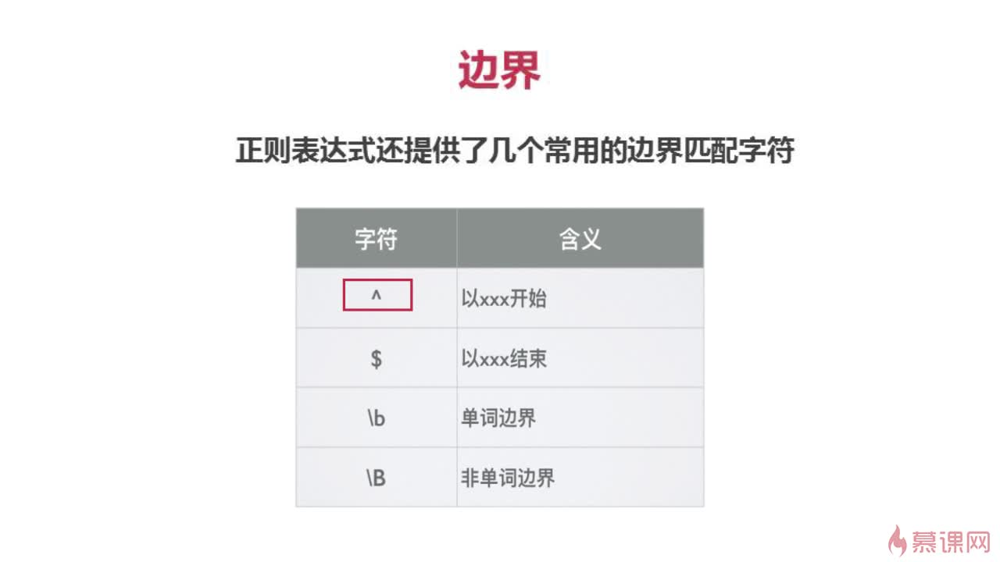
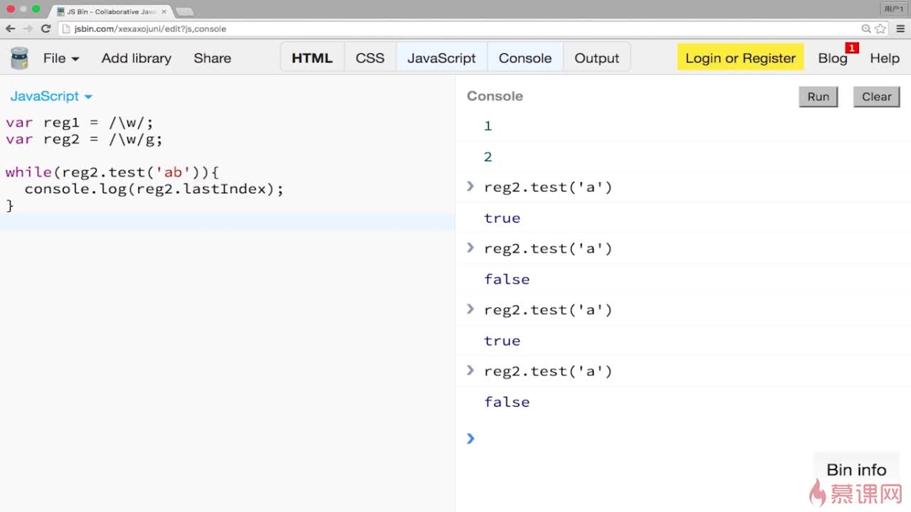
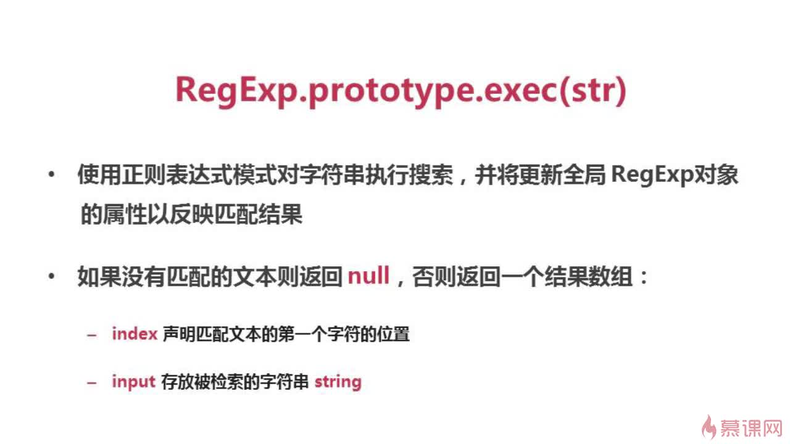
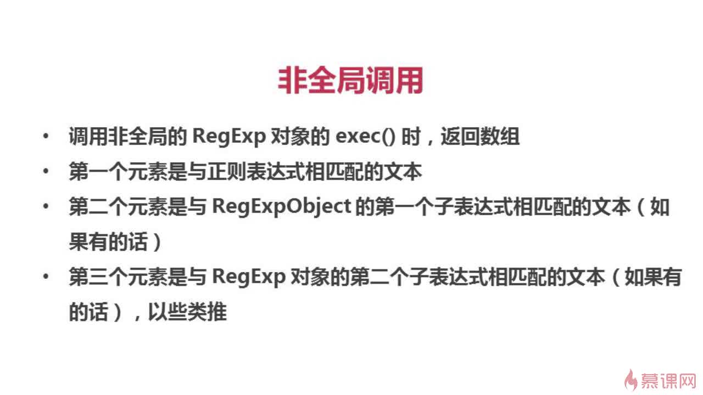
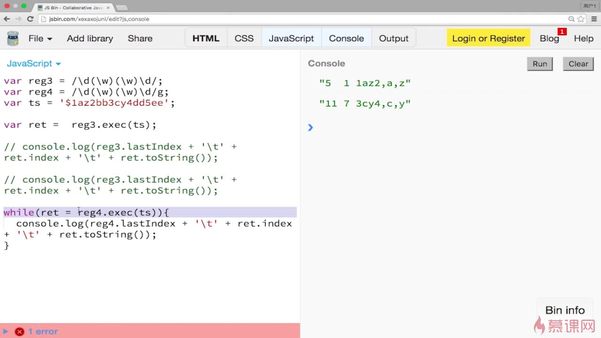
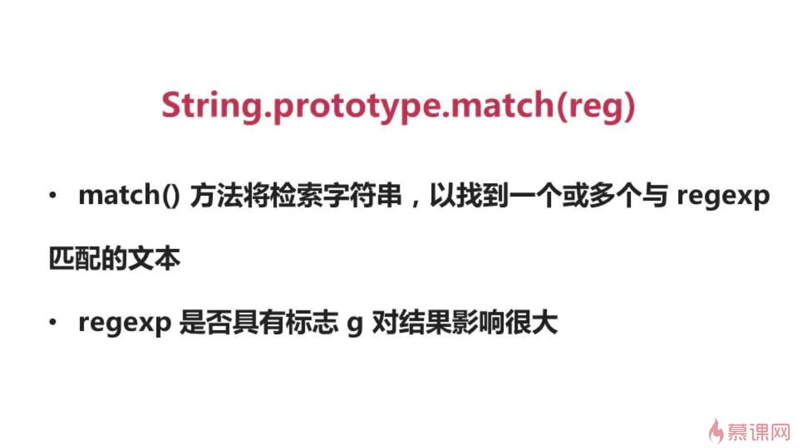
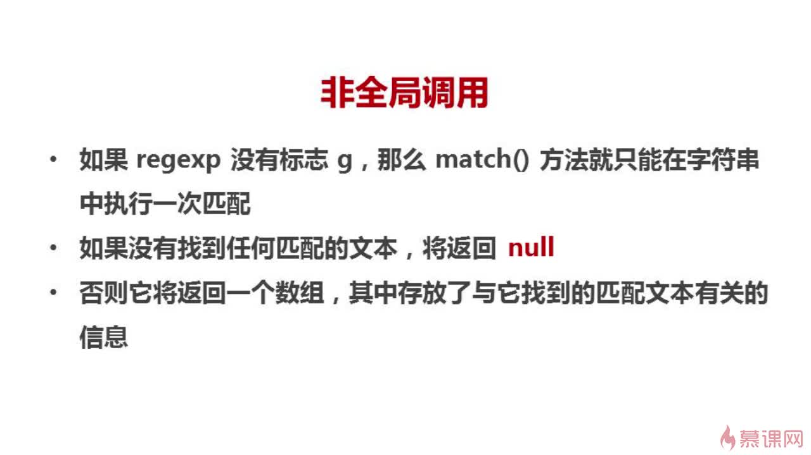
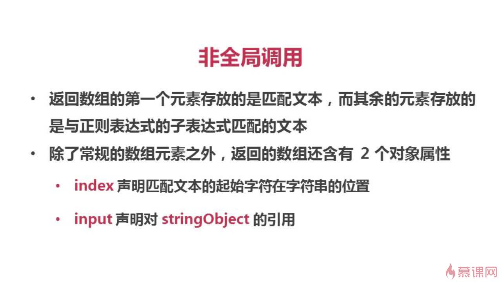
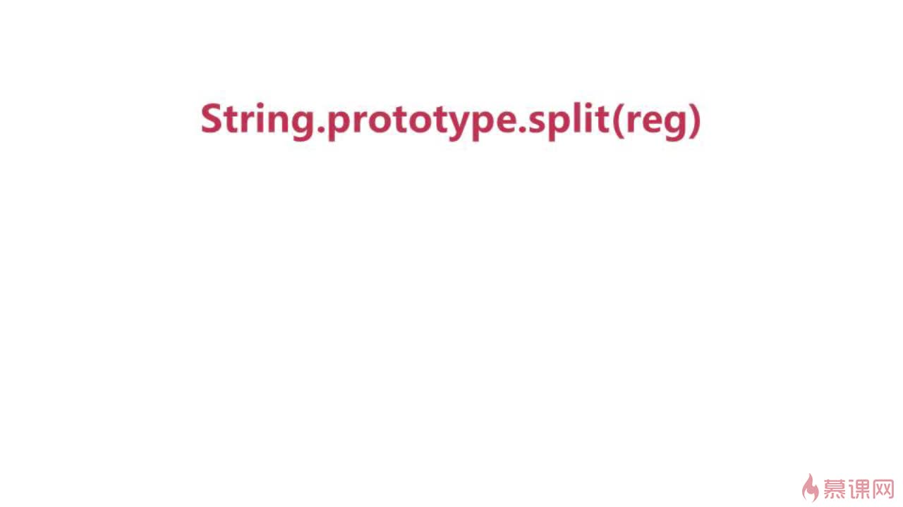

##正则表达式
正则表达式可以：   
1. 测试字符串的某个模式，例如可以对一个输入字符串进行测试，看该字符串是否存在一个电话号码的模式，这称为数据有效性验证  
2. 替换文本，可以在文档中使用一个正则表达式来标识特定文字，然后可以全部将其删除，或者替换为别的文字  
3. 根据模式匹配从字符串中提取一个子字符串，可以用来在文本或输入字段中查找特定文字
#REGEXP对象
JS通过内置对象RegExp支持正则表达式  
有两种方法实例化RegExp对象   
**1.字面量**

	var reg = /\bis\b/g;
	g:gobol全文匹配
	\b:单词边界
**2.构造函数**

	var reg = new RegExp('\\bis\\b',g);
#修饰符
**i:ignore case 忽略大小写**

	‘He is a boy.Is he?’.repalce(/\bis\b/gi,0)
**m:多行搜索**
#元字符
基本字符类型  
**1.原义文本字符**   
**2.元字符：**在正则表达式中有特殊含义的非字母字符

	.*+？^$
#字符类[]
**1.**一般情况下正则表达式一个字符对应字符串一个字符  

	ab\t :"ab"和水平制表符
	
**2.**匹配一类字符  
[abc]把字符a或b或c归为一类，表达式可以匹配这类字符 one of "a""b""c"
	
	'a1b2c3'.replace(/[abc]/g,'x')
	==>"x1x2x3"
#字符类取反^
使用^创建反向类  
反向类：不属于某类的内容    
[^abc]:不是a或a或c的内容

	'a1b2c3'.replace(/[^abc]/g,'x')
	==>"axbxcx"
#范围类
[a-z]：a到z的任意字符

	‘a1b2c3x4z9’.replace(/[a-z]/g,'Q')
	==>"Q1Q2A3A4A9"
大小写匹配
[a-zA-Z]可连写

	‘a1A1b2c3x4z9’.replace(/[a-zA-Z]/g,'Q')
	==>"Q1Q1Q2A3A4A9"
匹配横线
	
	‘1-1-2-3-4-9’.replace(/[0-9-]/g,'Q')
	==>"QQQQQQQQQ"
#预定义类
:
#边界
:

	@123@abc.replac(/^@./g,'x')
		-->x123@abc
#量词
:
#贪婪模式
尽可能多得匹配

	‘12345678’.replace(/\d{3,6}/g,'X')
	-->"X78"
#非贪婪模式
一但匹配成功不进行匹配：在量词后加？
#分组（）   用$引用
#忽略分组
不想捕获某分组，在分组内加上?: 
#或| 
#前瞻
:
正向前瞻：exp(?=assert)
负向前瞻:exp(?!assert)

	‘a2*34v8’.replace(/\w(?=\d)/g,'x')
	(?=\d)断言	
	==》x2*x4x8
#对象属性(只读)
:

	var reg1 = /\w/;
	var reg2 = /\w/gim;
	reg1.global
	==>false
	reg2.global
	==>true
	reg1.source
	"\w"
#方法
# test() #
:
:
# exec #
:
:
:
全局调用
:
# search() #
:
	
	--->6
# match #
:
	
			---------->
	world
	null
	null
	world!
非全局调用
:
:
全局调用
:
# split() #
:

	function SplitDemo(){ 
	var s, ss; 
	var s = "The rain in Spain falls mainly in the plain."; 
	// 正则表达式，用不分大不写的s进行分隔。 
	ss = s.split(/s/i); 
	return(ss); 
	} 
	document.write(SplitDemo()); 
		------>
	The rain in ,pain fall, mainly in the plain. 

# replace #
:
:
#()
正则表达式使用圆括号进行组匹配。
	
	const RE_DATE = /(\d{4})-(\d{2})-(\d{2})/;
	const matchObj = RE_DATE.exec('1999-12-31');
	const year = matchObj[1]; // 1999
	const month = matchObj[2]; // 12
	const day = matchObj[3]; // 31
#/1
配合()使用，/1代表小括号里的内容；
	
	s/\(abc\)/[\1]/   -------->将abc变成[abc]  
http://www.runoob.com/regexp/regexp-metachar.html
[http://www.runoob.com/regexp/regexp-metachar.html](http://www.runoob.com/regexp/regexp-metachar.html)