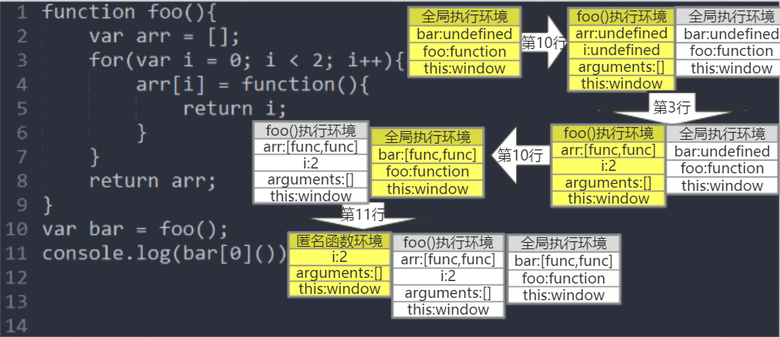
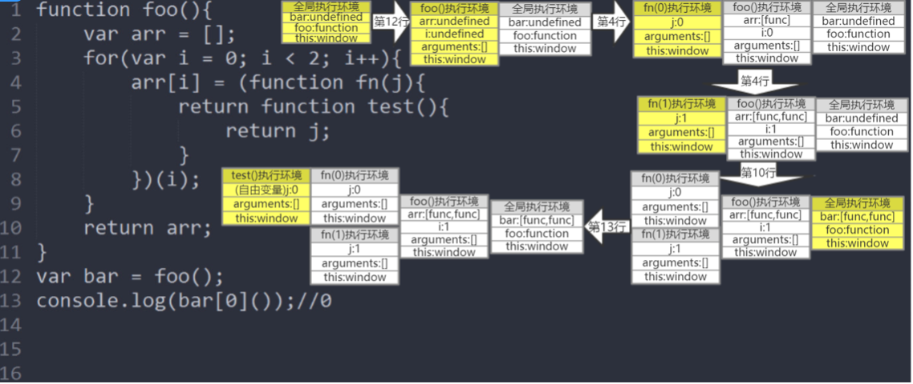

# 闭包
## 函数作为返回值被返回

	function F(){
		var a = 1;
		function foo(){
			return a;
		}
		return foo;
	}		
	console.log(F()());   
## 函数被赋给一个变量
	
	var ret;
	function F(){
		var a = 1;
		function foo(){
			return a;
		}
		ret = foo;
	}
	F() 	 	
	console.log(ret());
作用：
在在作用域以外的地方（全局作用域)中执行函数，但函数有其特定的作用域

## 立即执行函数
	
	function inner(fn){
		console.log(fn());	
	}
	(function(){
	var a = 1;
	function foo(){
		return a;
	}
	inner(foo)
	 })()

在立即执行函数中被声明（作用域）,在inner函数中被调用	
## 循环问题

	function foo(){
		var arr = [];
		for(var i = 0;i<2;i++){
			arr[i] = function(){
				return i;
			}
		}
		return arr;
	}
	var bar = foo();
	console.log(bar[0]());
:

### 使用立即执行函数，创建多个执行环境保存循环时各个状态的索引值

	function foo(){
		var arr =  [] ;
		for(var i = 0;i<2;i++){
			arr[i] = (function(j){
				return function test(){
					return j;
				}
			})(i)
		}
	return arr;
	}
	var bar = foo();
	console.log(bar[0]());
:
### 块作用域
循环中的变量使用let
## getter||setter
通过setValue和getValue将要操作的变量保存在函数内部，防止暴露在外部

	var getValule,setValue
	(function(){
	var a = 0;
	getValue = function(){
		return a;
	}
	setValue = function(i){
		if(typeof i === 'number'){
			a = i;
		}
	}
	})()
	console.log(getValue());
	setValue(1);
	console.log(getValue());
## 使用闭包实现迭代器
	
	function F(arr){
		var i = 0;
		return function(){
			return arr[i++]
		} 
	}
	var next = F([1,2,3]);
	console.log(next());//1
	console.log(next());//2
## 使用闭包区分首次
	
	var firstLoad = (function(id){
	var list = [];
	return function(id){
		if(list.indexOf(id) >= 0){
			return false;
		}else{
			list.push(id);
			return true;
		}
	}
	})();
	console.log(firstLoad(10));
	console.log(firstLoad(10));
	console.log(firstLoad(2));
## 模拟缓存机制

	var mult = function(){
	var cache = {};
	var calculate = function(){
		var a = 1;
		console.log(arguments);
		for(var i = 0,len = arguments.length;i<len;i++){
			a = a*arguments[i];
		}
		return a;
	}
	return function(){
		var args = Array.prototype.join.call(arguments,",");//"2,3"
		if(args in cache){
			return cache[args];
		}
		cache[args] = calculate.apply(null,arguments);
		return cache[args];//6
	}
	}()
	mult(2,3);
如果参数在缓存中存在，直接从缓存中取，如果不存在放入缓存中
## Ping图像数据上报
还记得跨域请求中的标签实现的单向通信吗

	var	img = new Image();
		img.onload = img.onerror = function(){
			alert("Done!");
		} ;
		img.src = "http://.....";

现在我们将其封装在一个函数中

	var report = function(src){
	  var img = new Image();
	  img.src = src;
	}
	report('http://xx.com/getUserInfo');
但是这样可能会导致数据上报不完全，因为当函数调用完以后，img变量就销毁，有可能现在还没有来得及发送HTTP请求哟~  
因此我们把img变量用闭包封装起来
	
	var report = (function(){
	var imgs = [];
	return function(src){
		var	img = new Image();
		img.onload = img.onerror = function(){
			alert("Done!");
		} ;
		img.src = src;
	}
	})()
	report("http://.....")
