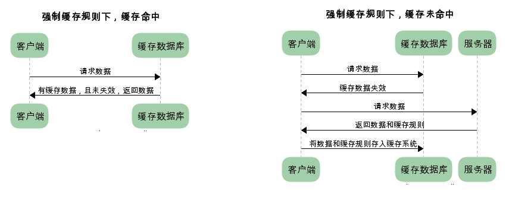
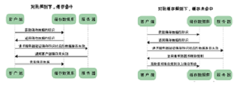
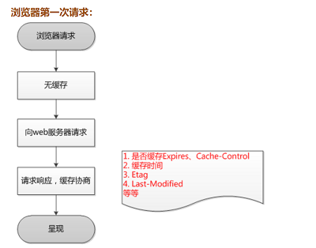
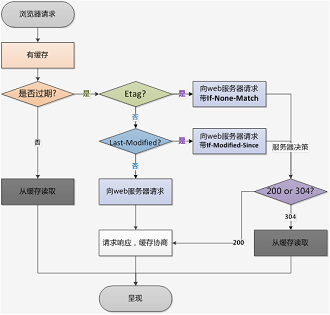

#### 深拷贝和浅拷贝   
浅拷贝就是变量赋值，改变指针指向,因此后被拷贝的b变量的值进行改变，堆中的值也随之改变，则原来的a指针的值也改变  
深拷贝是将其比如对象迭代出来，常用的方法有，其不会改变原先的值  
	
	1.concat
	2.$.extend(ture,[],a)  
	3. slice()  
	4. Object.assign(被复制，复制源) //Es6 mixin的代替
对于对象浅拷贝只能拷贝出第一层属性（使用for的迭代）  
而深拷贝则是将第一层对象中的对象也迭代出来  
### JS多线程  

	var worker = new Worker("a.js");
	worker.onmessage = function(){
		var message = event.data;
	}
	stop.addEventListener('click',function(){
		worker.terminate();
	});
	start.addEventListenter('click',function(){
		worker = new Worker("a.js");
	});

	//a.js
	
	(function(){
		var i = 0;
		postMeesage(i);
	})();
### cookie和session

  （1）cookie是在保存客户端的，然后将sessionId发送带服务端，服务端再根据sessionID进行查找，查到对应的信息再返回给cookie，cookie有时间期限，若没有设置则关闭浏览器以后cookie将不再保存？cookie相对于session是比较新的方法，缺点是安全性不高，优点是没有性能问题？

  （2）session是在服务器端的，数据保存在数据库中，优点是安全性高，数据不会被修改，外界难以攻破。而缺点正式因为所有的都保存在了数据库中
	
	
### mouseover和mouseout、mouseenter和mouseleave的区别？   
mouseenter不支持冒泡 
### ES6数组去重
var arr = [1,1,3,4,4];	
Array.from(new Set(arr));
### 闭包和作用域链  
### 静态页面为什么会单独存储	  
#### 静态页面：  
实际存在的，无需经过服务器的编译，直接在客户端的浏览器上显示，不需要运行脚本、程序和读取后台数据库，直接在服务器发送数据给客户端，访问速度快，搜索引擎方便访问；缺点是不方便修改更新网页      
#### 伪静态页面：  
根据正则筛选，不占用主机内存，在服务器中，占用的是CPU性能，在网址后没有？&， 搜索排名比较靠前  
#### 动态页面：  
在服务器运行的程序，组件，网页属于动态网页，会随时间，客户的不同返回相应的网页
是根据URL后加上？访问请求来处理的，因此搜索引擎不容易搜到；其次由于使用前后台交互，安全性不高；最后访问的是数据库，一旦打开一个页面就访问一次数据库，如何访问人数多，对服务器增加负荷，影响网站运行速度
### 重绘与重排   
页面加载是先加载它的DOM数再渲染树的每个节点的属性（盒子）最后将元素放入渲染样式属性  
重绘是改变元素的visibility,color，outline等属性不会带来浏览器新的布局
重排是由于元素的大小，位置，DOM节点发生变化（增加减少元素）而使布局需要重排
### eventHandler  
### 浏览器的存储技术  
### 冒泡排序等  捕获
### JS面向对象  有哪几种设计模式（观察者模式）  
### websocket  
### BCF  
### 函数缓存 
忍者秘笈的“函数科里化和“搞基函数”  
### H5调用相机在移动端的兼容  
### SASS  
### GET和post区别  
### Promise事件机制和事件代理  
### 页面渲染
1.解析html结构2.加载外部脚本和样式表文件3.解析执行外部脚本4.渲染Dom树(Domready)4.加载图片等外部文件5.页面加载完成（window.onload）

### 同步异步区别
阻塞和非阻塞
### HTTP缓存机制
#### 强制缓存
expires
cache-control
etag
last-modified
#### 对比缓存(缓存标识)
Etag
if-none-match
last-modified
:
:
:
:
